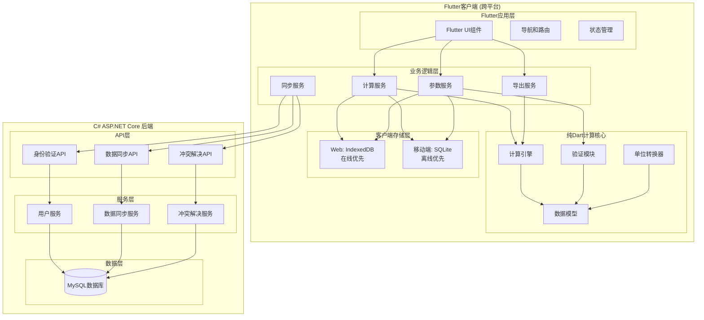
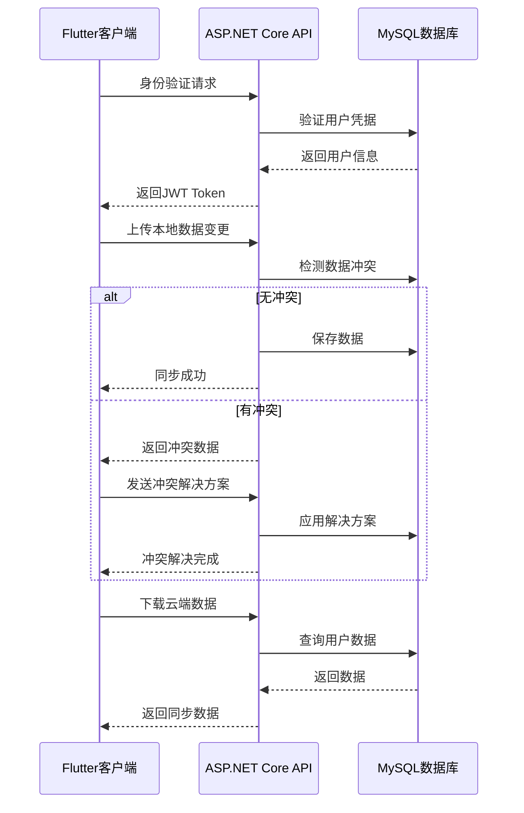

# 设计文档

## 概述

油气管道开孔封堵计算系统是一个基于Flutter单一代码库的跨平台工程计算应用，通过Flutter框架同时构建Web、iOS和Android三个平台的应用。系统采用纯Dart实现所有业务逻辑，确保跨平台的计算结果完全一致和用户体验统一。

### 核心设计原则

- **精度优先**: 所有计算保持0.1mm以内的精度误差
- **离线优先**: 核心功能完全离线可用，云同步为可选功能
- **工业适配**: 界面设计适合现场作业环境
- **模块化**: 各计算模块独立，便于维护和扩展
- **Flutter单栈**: 统一使用Flutter/Dart技术栈，简化开发和维护
- **本地优先**: 优先保证本地功能稳定，远程功能作为增强特性

## 架构

### 系统架构

系统采用**Flutter客户端 + C# ASP.NET Core后端**的分离式架构，Flutter负责所有计算逻辑和用户交互，后端仅负责数据同步服务。



### 技术栈

#### 客户端技术栈（Flutter）
- **框架**: Flutter 3.38+
- **编程语言**: Dart 3.0+（所有业务逻辑和计算统一使用）
- **状态管理**: Provider 或 Riverpod
- **UI组件库**: Flutter Material Design 3
- **本地存储**: 
  - Web平台: IndexedDB（在线优先模式）
  - 移动端: sqflite（SQLite，离线优先模式）+ shared_preferences
- **图形绘制**: Flutter Canvas API + CustomPainter
- **文件导出**: pdf包 + excel包
- **网络请求**: http包 或 dio包（用于数据同步）
- **测试框架**: Flutter test包

#### 后端技术栈（仅用于数据同步）
- **框架**: ASP.NET Core 8.0+
- **编程语言**: C# 12.0+
- **数据库**: MySQL 8.0+
- **ORM**: Entity Framework Core
- **身份验证**: ASP.NET Core Identity + JWT
- **API文档**: Swagger/OpenAPI
- **部署**: 传统服务器部署（Windows Server 或 Linux）

#### 平台特定存储策略
- **Web平台**: 在线优先，使用IndexedDB缓存，不支持完全离线
- **iOS/Android平台**: 离线优先，使用SQLite本地存储，支持完全离线计算

### 开发模块划分

**核心模块**:
1. **计算引擎模块**: 纯Dart数学计算，所有平台共享
2. **UI界面模块**: Flutter组件，基于计算引擎构建
3. **本地数据模块**: SQLite本地存储，支持离线使用
4. **平台集成模块**: 各平台特定功能封装

**开发顺序**:
- **第一阶段**: 计算引擎 + 基础UI，实现核心离线功能
- **第二阶段**: 完善UI交互 + 本地数据存储
- **第三阶段**: 平台特定功能 + 可选的云同步功能

## 组件和接口

### 核心组件接口

#### 1. 计算引擎接口

```dart
abstract class ICalculationEngine {
  HoleCalculationResult calculateHoleSize(HoleParameters params);
  ManualHoleResult calculateManualHole(ManualHoleParameters params);
  SealingResult calculateSealing(SealingParameters params);
  PlugResult calculatePlug(PlugParameters params);
  StemResult calculateStem(StemParameters params);
  ValidationResult validateParameters(CalculationType type, dynamic params);
}
```

#### 2. 参数管理接口

```dart
abstract class IParameterService {
  Future<List<PresetParameter>> getPresetParameters(CalculationType type);
  Future<void> saveParameterSet(ParameterSet parameterSet);
  Future<List<ParameterSet>> getUserParameterSets();
  Future<void> deleteParameterSet(String id);
  double convertUnit(double value, UnitType from, UnitType to);
}
```

#### 3. 数据同步接口

```dart
abstract class IDataSyncService {
  // 用户身份验证
  Future<AuthResult> login(String username, String password);
  Future<void> logout();
  Future<bool> isAuthenticated();
  
  // 数据同步
  Future<void> saveCalculationRecord(CalculationRecord record);
  Future<List<CalculationRecord>> getCalculationHistory({int? limit});
  Future<void> deleteCalculationRecord(String id);
  Future<String> exportData(); // JSON格式
  Future<void> importData(String data);
  
  // 云端同步（通过C# ASP.NET Core后端）
  Future<SyncResult> syncToCloud();
  Future<SyncResult> syncFromCloud();
  Future<ConflictResolution> resolveConflicts(List<DataConflict> conflicts);
}
```

#### 4. 后端API接口（C# ASP.NET Core）

```csharp
// 身份验证控制器
[ApiController]
[Route("api/[controller]")]
public class AuthController : ControllerBase
{
    [HttpPost("login")]
    public async Task<ActionResult<AuthResponse>> Login(LoginRequest request);
    
    [HttpPost("logout")]
    [Authorize]
    public async Task<ActionResult> Logout();
    
    [HttpGet("profile")]
    [Authorize]
    public async Task<ActionResult<UserProfile>> GetProfile();
}

// 数据同步控制器
[ApiController]
[Route("api/[controller]")]
[Authorize]
public class SyncController : ControllerBase
{
    [HttpPost("upload")]
    public async Task<ActionResult<SyncResponse>> UploadData(SyncRequest request);
    
    [HttpGet("download")]
    public async Task<ActionResult<SyncData>> DownloadData(DateTime? lastSync);
    
    [HttpPost("resolve-conflicts")]
    public async Task<ActionResult<ConflictResolution>> ResolveConflicts(ConflictRequest request);
}
```

### 数据模型

#### 核心数据结构

**计算参数模型**:
```dart
class HoleParameters {
  final double outerDiameter;      // 管外径
  final double innerDiameter;      // 管内径
  final double cutterOuterDiameter; // 筒刀外径
  final double cutterInnerDiameter; // 筒刀内径
  final double a;                  // A值
  final double b;                  // B值
  final double r;                  // R值
  final double initialValue;       // 初始值
  final double gasketThickness;    // 垫片厚度
}
```

**计算结果模型**:
```dart
class HoleCalculationResult {
  final double emptyStroke;        // 空行程
  final double cuttingDistance;    // 切削距离
  final double chordHeight;        // 掉板弦高
  final double cuttingSize;        // 切削尺寸
  final double totalStroke;        // 总行程
  final double plateStroke;        // 掉板总行程
  final DateTime calculationTime;
  final HoleParameters parameters;
}
```

## 数据存储

### 客户端存储设计

#### Web平台存储（在线优先）

**IndexedDB存储结构**:
```javascript
// 计算记录存储
const calculationStore = {
  keyPath: 'id',
  indexes: [
    { name: 'calculation_type', keyPath: 'calculationType' },
    { name: 'created_at', keyPath: 'createdAt' }
  ]
};

// 参数组存储
const parameterStore = {
  keyPath: 'id',
  indexes: [
    { name: 'calculation_type', keyPath: 'calculationType' },
    { name: 'name', keyPath: 'name' }
  ]
};
```

**Web平台存储策略**:
- 优先使用云端数据，本地IndexedDB作为缓存
- 网络不可用时，明确提示功能限制
- 不支持完全离线计算和存储

#### 移动端存储（离线优先）

**SQLite表结构**:
```sql
-- 计算记录表
CREATE TABLE calculation_records (
  id TEXT PRIMARY KEY,
  calculation_type TEXT NOT NULL,
  parameters TEXT NOT NULL, -- JSON格式
  results TEXT NOT NULL,    -- JSON格式
  created_at INTEGER NOT NULL,
  updated_at INTEGER NOT NULL,
  synced BOOLEAN DEFAULT FALSE
);

-- 参数组表
CREATE TABLE parameter_sets (
  id TEXT PRIMARY KEY,
  name TEXT NOT NULL,
  calculation_type TEXT NOT NULL,
  parameters TEXT NOT NULL, -- JSON格式
  is_preset BOOLEAN DEFAULT FALSE,
  created_at INTEGER NOT NULL,
  updated_at INTEGER NOT NULL,
  synced BOOLEAN DEFAULT FALSE
);

-- 用户设置表
CREATE TABLE user_settings (
  key TEXT PRIMARY KEY,
  value TEXT NOT NULL,
  updated_at INTEGER NOT NULL
);

-- 同步状态表
CREATE TABLE sync_status (
  table_name TEXT PRIMARY KEY,
  last_sync_time INTEGER NOT NULL,
  sync_version INTEGER DEFAULT 1
);
```

### 后端数据库设计（C# + MySQL）

#### MySQL数据库结构

```sql
-- 用户表
CREATE TABLE Users (
    Id VARCHAR(36) PRIMARY KEY,
    Username VARCHAR(50) UNIQUE NOT NULL,
    PasswordHash VARCHAR(255) NOT NULL,
    Email VARCHAR(100),
    CreatedAt DATETIME NOT NULL,
    UpdatedAt DATETIME NOT NULL,
    IsActive BOOLEAN DEFAULT TRUE
);

-- 计算记录表
CREATE TABLE CalculationRecords (
    Id VARCHAR(36) PRIMARY KEY,
    UserId VARCHAR(36) NOT NULL,
    CalculationType VARCHAR(50) NOT NULL,
    Parameters JSON NOT NULL,
    Results JSON NOT NULL,
    CreatedAt DATETIME NOT NULL,
    UpdatedAt DATETIME NOT NULL,
    DeviceId VARCHAR(100),
    FOREIGN KEY (UserId) REFERENCES Users(Id),
    INDEX idx_user_type (UserId, CalculationType),
    INDEX idx_created_at (CreatedAt)
);

-- 参数组表
CREATE TABLE ParameterSets (
    Id VARCHAR(36) PRIMARY KEY,
    UserId VARCHAR(36) NOT NULL,
    Name VARCHAR(100) NOT NULL,
    CalculationType VARCHAR(50) NOT NULL,
    Parameters JSON NOT NULL,
    IsPreset BOOLEAN DEFAULT FALSE,
    CreatedAt DATETIME NOT NULL,
    UpdatedAt DATETIME NOT NULL,
    FOREIGN KEY (UserId) REFERENCES Users(Id),
    INDEX idx_user_type (UserId, CalculationType)
);

-- 同步日志表
CREATE TABLE SyncLogs (
    Id VARCHAR(36) PRIMARY KEY,
    UserId VARCHAR(36) NOT NULL,
    DeviceId VARCHAR(100) NOT NULL,
    SyncType VARCHAR(20) NOT NULL, -- 'upload' or 'download'
    RecordCount INT NOT NULL,
    SyncTime DATETIME NOT NULL,
    Status VARCHAR(20) NOT NULL, -- 'success' or 'failed'
    ErrorMessage TEXT,
    FOREIGN KEY (UserId) REFERENCES Users(Id)
);
```

### 数据同步设计

#### 同步策略

**移动端同步策略**:
- **触发条件**: 网络恢复时自动同步，或用户手动触发
- **同步方向**: 双向同步（上传本地更改，下载云端更改）
- **冲突检测**: 基于时间戳和设备ID进行冲突检测
- **冲突解决**: 提供三种选项（保留本地/保留云端/合并数据）

**Web端同步策略**:
- **触发条件**: 实时同步，每次操作直接与云端交互
- **缓存策略**: 使用IndexedDB缓存最近数据，提升响应速度
- **离线处理**: 网络不可用时，明确提示功能不可用

#### 同步流程



#### 冲突解决机制

**冲突检测**:
- 基于记录的`UpdatedAt`时间戳
- 结合`DeviceId`识别数据来源
- 检测同一记录在不同设备上的并发修改

**冲突解决选项**:
1. **保留本地**: 使用客户端版本，覆盖云端数据
2. **保留云端**: 使用云端版本，覆盖本地数据  
3. **合并数据**: 智能合并两个版本的数据（如适用）

**冲突解决接口**:
```dart
class DataConflict {
  final String recordId;
  final CalculationRecord localVersion;
  final CalculationRecord cloudVersion;
  final DateTime conflictDetectedAt;
}

enum ConflictResolutionStrategy {
  keepLocal,
  keepCloud,
  merge
}

class ConflictResolution {
  final String recordId;
  final ConflictResolutionStrategy strategy;
  final CalculationRecord? mergedData;
}
```

## 正确性属性

*属性是一个特征或行为，应该在系统的所有有效执行中保持为真——本质上是关于系统应该做什么的正式陈述。属性作为人类可读规范和机器可验证正确性保证之间的桥梁。*

基于需求分析，以下是系统必须满足的核心正确性属性：

### 属性 1: 数学公式计算正确性
*对于任何*有效的输入参数集合，所有数学公式的计算结果都应该与手动计算的结果在0.1mm精度范围内一致
**验证需求: 1.1, 1.2, 1.3, 1.4, 1.5, 1.6, 2.1, 2.2, 2.3, 3.1, 3.2, 4.1, 4.2, 4.3, 5.1**

### 属性 2: 输入参数验证
*对于任何*无效的输入参数（负数、零值、超出范围），系统应该拒绝计算并提供相应的错误或警告信息
**验证需求: 1.7, 2.4, 3.4, 4.4, 5.2, 10.5**

### 属性 3: 参数组往返一致性
*对于任何*参数组，保存后立即加载应该得到完全相同的参数值
**验证需求: 6.2, 6.3**

### 属性 4: 单位转换往返保持
*对于任何*数值，从毫米转换到英寸再转换回毫米应该得到原始值（在精度范围内）
**验证需求: 6.5**

### 属性 5: 示意图元素完整性
*对于任何*计算结果，生成的示意图应该包含所有必需的关键位置标注
**验证需求: 7.2, 7.5**

### 属性 6: 离线功能完整性（移动端）
*对于任何*核心计算功能，在移动端无网络连接状态下应该能够正常执行并保存结果
**验证需求: 9.2, 12.1, 12.2, 12.4**

### 属性 7: Web端在线功能提示
*当Web端网络不可用时*，系统应该明确标识哪些功能需要网络连接并提供友好提示
**验证需求: 12.5**

### 属性 8: 跨平台计算一致性
*对于任何*相同的输入参数，Web、iOS和Android平台的计算结果应该完全一致（在0.1mm精度范围内）
**验证需求: 13.1, 13.2, 13.3**

### 属性 9: 数据同步冲突解决
*当发生数据冲突时*，系统应该提供三种明确的解决选项（保留本地/保留云端/合并数据）
**验证需求: 9.6**

## 错误处理

### 输入验证错误
- **参数范围错误**: 当输入参数超出合理范围时，显示具体的范围要求
- **参数逻辑错误**: 当参数之间存在逻辑冲突时（如管外径小于内径），提供清晰的错误说明
- **数值格式错误**: 当输入非数值内容时，提示正确的输入格式

### 计算错误
- **数学运算异常**: 当出现除零、负数开方等数学异常时，提供友好的错误提示
- **精度溢出**: 当计算结果超出精度范围时，提供警告并建议检查输入参数

### 数据操作错误
- **存储失败**: 当本地存储空间不足或权限不够时，提供解决方案建议
- **同步失败**: 当云端同步失败时，保证本地数据安全并提供重试选项
- **导出失败**: 当文件导出失败时，检查存储权限并提供替代方案
- **身份验证失败**: 当用户登录失败或token过期时，提供重新登录提示

### 网络错误
- **连接超时**: 移动端提供离线模式提示，Web端提示网络问题
- **同步冲突**: 当多设备数据冲突时，提供三种冲突解决选项界面
- **API错误**: 当后端API返回错误时，提供用户友好的错误信息

### 平台特定错误处理

#### Web平台错误处理
- **网络断开**: 明确提示当前功能不可用，建议检查网络连接
- **浏览器兼容性**: 检测不支持的浏览器功能并提供降级方案
- **存储配额**: 当IndexedDB存储空间不足时，提供清理建议

#### 移动端错误处理
- **离线状态**: 正常提供所有计算功能，标识同步功能不可用
- **权限错误**: 当缺少文件访问权限时，引导用户授权
- **内存不足**: 当设备内存不足时，优化内存使用或提示用户

## 测试策略

### Flutter统一测试架构

本系统采用**Flutter/Dart统一测试框架**的测试策略：

**单元测试**负责验证：
- 具体的计算示例和边缘情况
- 组件间的集成点
- 错误条件和异常处理
- 用户界面交互的特定场景

**基于属性的测试**负责验证：
- 通过随机化实现全面的输入覆盖
- 上述定义的8个核心正确性属性
- 数学计算的通用正确性
- 数据操作的一致性保证

### 测试配置要求

- 每个属性测试最少运行100次迭代（由于随机化特性）
- 每个属性测试必须引用其设计文档属性编号
- 标签格式: **功能: pipeline-calculation-app, 属性 {编号}: {属性文本}**

### 测试覆盖目标

- **功能覆盖**: 所有5个计算模块的完整测试
- **边界测试**: 参数边界值和极限情况
- **错误路径**: 所有错误处理分支
- **性能测试**: 计算响应时间和内存使用
- **兼容性测试**: Flutter跨平台的一致性验证
- **同步测试**: 数据同步和冲突解决机制测试
- **平台差异测试**: Web端在线模式和移动端离线模式的差异化测试

## 部署和发布

### 系统部署架构

#### 客户端部署（Flutter）

**Web平台构建**:
```bash
flutter build web --release --pwa-strategy offline-first
```

**移动端构建**:
```bash
# iOS构建（企业内部分发）
flutter build ipa --release --export-method enterprise

# Android构建（APK直接分发）
flutter build apk --release
```

#### 后端部署（C# ASP.NET Core）

**传统服务器部署**:
- 部署到Windows Server或Linux服务器
- 使用IIS（Windows）或Nginx（Linux）作为反向代理
- MySQL数据库独立安装和配置
- 不使用容器化技术，采用传统部署方式

**部署配置**:
```json
// appsettings.Production.json
{
  "ConnectionStrings": {
    "DefaultConnection": "Server=localhost;Database=pipeline_calc;Uid=api_user;Pwd=***;"
  },
  "JwtSettings": {
    "SecretKey": "***",
    "Issuer": "PipelineCalculationAPI",
    "Audience": "PipelineCalculationApp",
    "ExpiryMinutes": 60
  },
  "Logging": {
    "LogLevel": {
      "Default": "Information",
      "Microsoft.AspNetCore": "Warning"
    }
  }
}
```

### 部署策略

**客户端分发**:
- **Web**: 静态文件部署到Web服务器，支持PWA离线缓存
- **iOS**: 企业内部分发，通过IPA文件安装
- **Android**: APK直接分发，支持侧载安装

**后端服务**:
- **API服务**: 部署到传统服务器，提供RESTful API接口（仅用于数据同步）
- **数据库**: MySQL独立安装，仅存储用户数据和同步记录
- **负载均衡**: 使用Nginx进行反向代理（如需要）
- **重要说明**: 后端不参与任何计算逻辑，所有计算均在Flutter客户端完成

### 版本管理

**版本号规范**:
```yaml
# Flutter客户端 (pubspec.yaml)
version: 1.0.0+1

# ASP.NET Core后端 (项目文件)
<Version>1.0.0</Version>
<AssemblyVersion>1.0.0.0</AssemblyVersion>
```

**发布流程**:
1. 客户端和后端代码提交和测试
2. 后端API优先部署和验证（仅数据同步功能）
3. Flutter多平台构建
4. 客户端应用分发
5. 版本兼容性验证
6. 注意：所有计算逻辑仅在客户端，后端不涉及计算功能

### 监控和维护

**后端监控**:
```csharp
// ASP.NET Core健康检查（仅用于服务状态监控）
public void ConfigureServices(IServiceCollection services)
{
    services.AddHealthChecks()
        .AddMySql(connectionString);
}

// 基础日志记录（不记录计算相关内容）
public void Configure(IApplicationBuilder app)
{
    app.UseMiddleware<RequestLoggingMiddleware>();
    app.UseHealthChecks("/health");
}
```

**客户端更新机制**:
- **Web**: 自动更新，用户刷新页面获取最新版本
- **移动端**: 手动更新，通过新版本APK/IPA文件分发
- **API兼容性**: 后端API保持向后兼容，支持多版本客户端