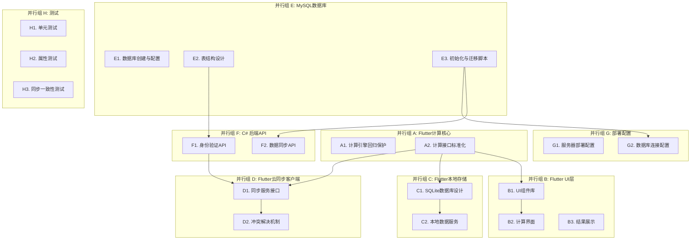

# 实现计划：油气管道开孔封堵计算系统

## 概述

本实现计划基于Flutter跨平台架构，采用并行开发策略，将系统拆分为8个独立的并行开发组。每个任务都有明确的输入、输出和验收标准，可以在不修改其他模块代码的前提下独立完成。

## 并行开发组架构

## 任务列表

### 并行组 A: Flutter计算核心（回归保护）
**并行组**: A  
**前置依赖**: 无  
**保护约束**: 🚫 禁止重写现有计算算法，仅允许接口标准化和回归测试

- [x] A1. 计算引擎回归保护
  **输入**: 现有计算逻辑代码  
  **输出**: 回归测试套件 + 计算引擎接口文档  
  **验收标准**: 所有现有计算功能通过回归测试，精度保持0.1mm以内  
  **并行组**: A  
  **前置依赖**: 无  
  **保护约束**: 🚫 不得修改任何计算公式或算法逻辑
  - 创建现有计算功能的完整回归测试
  - 记录所有计算接口的输入输出规范
  - 验证计算精度符合0.1mm要求
  - _需求: 1.1-1.7, 2.1-2.4, 3.1-3.4, 4.1-4.4, 5.1-5.2, 10.1-10.6_

- [x] A2. 计算接口标准化
  **输入**: 回归测试通过的计算引擎  
  **输出**: 标准化的ICalculationEngine接口实现  
  **验收标准**: 接口符合设计文档规范，所有计算模块可独立调用  
  **并行组**: A  
  **前置依赖**: A1  
  **保护约束**: 🚫 仅允许接口封装，不得修改计算逻辑
  - 实现ICalculationEngine接口
  - 标准化参数验证接口
  - 确保接口向后兼容
  - _需求: 13.1, 13.3_

### 并行组 B: Flutter UI层
**并行组**: B  
**前置依赖**: A2（计算接口）  
**保护约束**: 无

- [x] B1. UI组件库开发
  **输入**: Flutter项目结构 + 设计规范  
  **输出**: 可复用的UI组件库  
  **验收标准**: 组件库支持深色模式，高对比度配色，响应式布局  
  **并行组**: B  
  **前置依赖**: A2  
  - 实现深色模式主题
  - 创建高对比度配色方案
  - 开发响应式布局组件
  - 实现工业环境适配的UI组件
  - _需求: 11.1-11.6_

- [x] B2. 计算界面实现
  **输入**: UI组件库 + 计算引擎接口  
  **输出**: 5个计算模块的用户界面  
  **验收标准**: 界面支持参数输入验证，错误提示，计算触发  
  **并行组**: B  
  **前置依赖**: B1, A2  
  - 实现开孔尺寸计算界面
  - 实现手动开孔计算界面
  - 实现封堵尺寸计算界面
  - 实现下塞堵计算界面
  - 实现下塞柄计算界面
  - 集成参数验证和错误处理
  - _需求: 1.1-1.7, 2.1-2.4, 3.1-3.4, 4.1-4.4, 5.1-5.2_

- [x] B3. 结果展示与导出
  **输入**: 计算结果数据模型  
  **输出**: 结果展示界面 + 导出功能  
  **验收标准**: 支持PDF/Excel导出，示意图生成，结果高亮显示  
  **并行组**: B  
  **前置依赖**: B1  
  - 实现计算结果展示界面
  - 集成示意图生成功能
  - 实现PDF报告导出
  - 实现Excel数据导出
  - _需求: 7.1-7.6_

### 并行组 C: Flutter本地存储
**并行组**: C  
**前置依赖**: A2（数据模型接口）  
**保护约束**: 无

- [x] C1. SQLite数据库设计
  **输入**: 数据模型定义  
  **输出**: SQLite数据库Schema + 迁移脚本  
  **验收标准**: 数据库支持离线存储，数据完整性约束，版本迁移  
  **并行组**: C  
  **前置依赖**: A2  
  - 设计calculation_records表结构
  - 设计parameter_sets表结构
  - 设计user_settings表结构
  - 设计sync_status表结构
  - 创建数据库迁移脚本
  - _需求: 9.1, 9.5, 12.1-12.4_

- [x] C2. 本地数据服务实现
  **输入**: SQLite Schema + 数据模型接口  
  **输出**: 本地数据访问服务  
  **验收标准**: 支持CRUD操作，数据同步状态管理，离线功能完整  
  **并行组**: C  
  **前置依赖**: C1, A2  
  - 实现计算记录的本地存储
  - 实现参数组的本地管理
  - 实现用户设置的本地存储
  - 实现同步状态跟踪
  - _需求: 6.1-6.5, 9.1-9.2, 12.1-12.4_

### 并行组 D: Flutter云同步客户端
**并行组**: D  
**前置依赖**: F1（后端API）, C2（本地存储）  
**保护约束**: 无

- [x] D1. 同步服务接口实现
  **输入**: 后端API规范 + 本地数据服务  
  **输出**: 云同步客户端服务  
  **验收标准**: 支持双向同步，网络异常处理，同步状态管理  
  **并行组**: D  
  **前置依赖**: F1, C2  
  - 实现用户身份验证客户端
  - 实现数据上传同步
  - 实现数据下载同步
  - 实现网络异常处理
  - _需求: 9.3-9.4_

- [x] D2. 冲突解决机制
  **输入**: 同步服务 + 冲突检测逻辑  
  **输出**: 冲突解决用户界面 + 处理逻辑  
  **验收标准**: 提供三种冲突解决选项，用户友好的冲突解决界面  
  **并行组**: D  
  **前置依赖**: D1  
  - 实现冲突检测逻辑
  - 实现冲突解决选项界面
  - 实现数据合并逻辑
  - 实现冲突解决结果验证
  - _需求: 9.6_

### 并行组 E: MySQL数据库
**并行组**: E  
**前置依赖**: 无  
**保护约束**: 🚫 数据库仅存储用户数据，不包含计算逻辑

- [x] E1. 数据库创建与配置
  **输入**: MySQL服务器环境  
  **输出**: pipeline_calc数据库 + 数据库用户权限配置 + 环境变量配置模板  
  **验收标准**: 数据库创建成功，应用用户具有适当权限，可在不修改代码的情况下通过环境变量连接数据库，配置文档完整  
  **并行组**: E  
  **前置依赖**: 无  
  **保护约束**: 🚫 仅创建数据库和用户，不包含任何计算相关内容，不得在脚本中硬编码凭据
  - 创建pipeline_calc数据库
  - 创建应用专用数据库用户（用户名通过环境变量指定）
  - 配置用户权限（SELECT, INSERT, UPDATE, DELETE）
  - 设置数据库字符集为utf8mb4
  - 创建.env.example环境变量模板文件
  - 编写数据库连接配置文档（基于环境变量）
  - _需求: 9.3-9.6_

- [x] E2. 表结构设计与创建
  **输入**: 数据库设计规范 + pipeline_calc数据库  
  **输出**: 完整的数据库表结构  
  **验收标准**: 所有表创建成功，索引和约束正确，支持数据同步需求  
  **并行组**: E  
  **前置依赖**: E1  
  **保护约束**: 🚫 仅存储用户数据和同步记录，不存储计算逻辑
  - 创建Users表（用户管理）
  - 创建CalculationRecords表（计算记录存储）
  - 创建ParameterSets表（参数组存储）
  - 创建SyncLogs表（同步日志）
  - 创建必要的索引和外键约束
  - 验证表结构完整性
  - _需求: 9.3-9.6_

- [x] E3. 初始化与迁移脚本
  **输入**: 表结构设计  
  **输出**: 数据库初始化脚本 + 版本迁移机制 + 环境变量配置说明  
  **验收标准**: 支持数据库初始化，版本升级，数据迁移，回滚操作，所有脚本支持环境变量配置  
  **并行组**: E  
  **前置依赖**: E2  
  - 创建数据库初始化脚本（create_database.sql，支持环境变量）
  - 创建表结构脚本（create_tables.sql）
  - 创建初始数据脚本（insert_initial_data.sql）
  - 设计版本迁移机制（基于环境变量配置）
  - 创建数据备份脚本（支持动态连接配置）
  - 创建回滚脚本
  - 编写环境变量配置说明文档
  - _需求: 9.5_

### 并行组 F: C# 后端API
**并行组**: F  
**前置依赖**: E2（MySQL表结构）  
**保护约束**: 🚫 后端不得包含任何计算逻辑

- [x] F1. 身份验证API开发
  **输入**: MySQL Users表 + Entity Framework配置  
  **输出**: 用户认证API服务 + 环境变量配置支持  
  **验收标准**: 支持用户注册/登录，JWT Token管理，安全性验证，数据库连接通过环境变量配置  
  **并行组**: F  
  **前置依赖**: E2  
  **保护约束**: 🚫 仅处理用户认证，不涉及计算功能，不得硬编码数据库凭据
  - 配置Entity Framework Core连接（基于环境变量）
  - 实现用户注册API（POST /api/auth/register）
  - 实现用户登录API（POST /api/auth/login）
  - 实现JWT Token生成和验证（密钥通过环境变量配置）
  - 实现用户信息管理API（GET /api/auth/profile）
  - 实现密码哈希和验证
  - 创建appsettings.json配置模板（不包含敏感信息）
  - _需求: 9.3_

- [x] F2. 数据同步API开发
  **输入**: 身份验证API + MySQL所有表结构  
  **输出**: 数据同步RESTful API  
  **验收标准**: 支持数据上传/下载，冲突检测，同步日志记录  
  **并行组**: F  
  **前置依赖**: F1, E2  
  **保护约束**: 🚫 仅处理数据存储和同步，不进行任何计算
  - 实现计算记录同步API（POST/GET /api/sync/calculations）
  - 实现参数组同步API（POST/GET /api/sync/parameters）
  - 实现冲突检测API（POST /api/sync/resolve-conflicts）
  - 实现同步日志API（GET /api/sync/logs）
  - 实现数据版本控制机制
  - 实现批量数据操作
  - _需求: 9.3-9.6_

### 并行组 G: 部署配置
**并行组**: G  
**前置依赖**: E3（数据库脚本）, F2（后端API）  
**保护约束**: 无

- [x] G1. 服务器部署配置
  **输入**: C# 后端应用 + 部署环境  
  **输出**: 服务器部署配置文件 + 部署文档  
  **验收标准**: 支持Windows Server和Linux服务器部署，配置文档完整  
  **并行组**: G  
  **前置依赖**: F2  
  - 创建IIS部署配置（Windows Server）
  - 创建Nginx反向代理配置（Linux）
  - 配置应用程序池和权限
  - 创建systemd服务配置（Linux）
  - 编写部署操作文档
  - _需求: 部署要求_

- [x] G2. 数据库连接配置
  **输入**: MySQL数据库 + C# 后端应用  
  **输出**: 生产环境数据库连接配置 + 环境变量管理方案  
  **验收标准**: 连接配置安全，支持连接池，错误处理完善，完全基于环境变量配置  
  **并行组**: G  
  **前置依赖**: E3, F1  
  - 配置生产环境连接字符串模板（基于环境变量）
  - 设置连接池参数（通过配置文件）
  - 配置SSL连接（如需要，证书路径通过环境变量）
  - 实现数据库健康检查
  - 配置连接超时和重试机制
  - 创建环境变量部署指南
  - 验证配置的安全性和灵活性
  - _需求: 安全性要求_

### 并行组 H: 测试
**并行组**: H  
**前置依赖**: 各模块实现完成  
**保护约束**: 无

- [x] H1. 单元测试开发
  **输入**: 各模块实现代码  
  **输出**: 完整的单元测试套件  
  **验收标准**: 代码覆盖率≥80%，所有核心功能有单元测试  
  **并行组**: H  
  **前置依赖**: A2, B2, C2, D2, F2  
  - 编写计算引擎单元测试
  - 编写UI组件单元测试
  - 编写数据服务单元测试
  - 编写API服务单元测试
  - _需求: 10.1-10.6_

- [x] H2. 属性测试开发

  **输入**: 正确性属性定义  
  **输出**: 基于属性的测试套件  
  **验收标准**: 实现9个核心正确性属性的属性测试，每个测试≥100次迭代  
  **并行组**: H  
  **前置依赖**: A2, C2  
  - **属性 1: 数学公式计算正确性**
  - **验证需求: 1.1-1.6, 2.1-2.3, 3.1-3.2, 4.1-4.3, 5.1**
  - **属性 2: 输入参数验证**
  - **验证需求: 1.7, 2.4, 3.4, 4.4, 5.2, 10.5**
  - **属性 3: 参数组往返一致性**
  - **验证需求: 6.2, 6.3**
  - **属性 4: 单位转换往返保持**
  - **验证需求: 6.5**
  - **属性 5: 示意图元素完整性**
  - **验证需求: 7.2, 7.5**
  - **属性 6: 离线功能完整性（移动端）**
  - **验证需求: 9.2, 12.1, 12.2, 12.4**
  - **属性 7: Web端在线功能提示**
  - **验证需求: 12.5**
  - **属性 8: 跨平台计算一致性**
  - **验证需求: 13.1, 13.2, 13.3**
  - **属性 9: 数据同步冲突解决**
  - **验证需求: 9.6**

- [x]* H3. 同步一致性测试
  **输入**: 云同步功能 + 本地存储  
  **输出**: 数据同步一致性测试套件  
  **验收标准**: 验证多设备数据同步的一致性，冲突解决的正确性  
  **并行组**: H  
  **前置依赖**: D2, F2  
  - 测试多设备数据同步一致性
  - 测试冲突检测和解决机制
  - 测试网络异常情况下的数据完整性
  - 测试同步性能和可靠性
  - _需求: 9.3-9.6, 13.2_

## 集成和验收检查点

- [x] 检查点 1: 核心计算功能验证
  **前置依赖**: A1, A2完成  
  **验收标准**: 所有计算功能通过回归测试，接口标准化完成
  - 确保所有计算测试通过，询问用户是否有问题

- [ ] 检查点 2: 数据库基础设施就绪
  **前置依赖**: E1, E2, E3完成  
  **验收标准**: MySQL数据库创建完成，表结构正确，初始化脚本可用
  - 确保数据库基础设施就绪，询问用户是否有问题

- [ ] 检查点 3: 基础功能集成
  **前置依赖**: B2, C2完成  
  **验收标准**: UI界面可以调用计算引擎，本地存储功能正常
  - 确保UI和本地存储集成正常，询问用户是否有问题

- [x] 检查点 4: 后端API服务就绪
  **前置依赖**: F1, F2完成  
  **验收标准**: 后端API服务正常运行，数据库连接正常
  - 确保后端API服务正常，询问用户是否有问题

- [x] 检查点 5: 云同步功能验证
  **前置依赖**: D2, G2完成  
  **验收标准**: 云同步功能完整，冲突解决机制正常工作
  - 确保云同步功能正常，询问用户是否有问题

- [ ] 检查点 6: 完整系统测试
  **前置依赖**: 所有功能模块完成  
  **验收标准**: 系统端到端功能正常，性能满足要求
  - 确保所有测试通过，询问用户是否有问题

## 注意事项

### 计算引擎保护约束
- 🚫 **严格禁止**: 重写或修改任何现有的计算算法和数学公式
- ✅ **允许操作**: 接口封装、参数验证、错误处理、性能优化
- ✅ **必须操作**: 创建完整的回归测试确保计算精度不变

### 数据库安全配置约束
- 🚫 **严格禁止**: 在任何代码或脚本中硬编码数据库用户名、密码或连接字符串
- ✅ **必须使用**: 环境变量或外部配置文件管理所有敏感信息
- ✅ **必须提供**: .env.example模板文件和配置说明文档
- ✅ **必须验证**: 应用可以在不修改代码的情况下连接到不同环境的数据库

### 后端开发约束
- 🚫 **严格禁止**: 在后端实现任何计算逻辑
- ✅ **允许功能**: 用户认证、数据存储、数据同步、冲突解决
- ✅ **必须验证**: 后端API仅处理数据，不参与计算过程

### MySQL数据库独立性
- ✅ **独立开发**: MySQL数据库任务（并行组E）完全独立，不依赖Flutter前端
- ✅ **优先级保证**: MySQL表结构必须在C# 后端API开发之前完成
- ✅ **显式任务**: 数据库创建、表结构设计、迁移脚本都作为独立任务列出
- ✅ **连接配置**: 明确定义数据库连接配置和权限管理

### 后端API依赖关系
- 📋 **F1 (身份验证API)** 依赖于 **E2 (MySQL表结构)**
- 📋 **F2 (数据同步API)** 依赖于 **F1 + E2**
- 📋 **G2 (数据库连接配置)** 依赖于 **E3 + F1**

### 并行开发协调
- 各并行组可以同时开始开发，但需要遵循前置依赖关系
- 接口定义完成后，依赖方可以基于接口进行开发
- 定期进行集成测试，确保各模块协同工作正常

### 测试策略
- 单元测试和属性测试并行进行
- 属性测试重点验证系统的正确性属性
- 同步一致性测试确保多设备数据的一致性
- 所有测试必须在集成前完成并通过